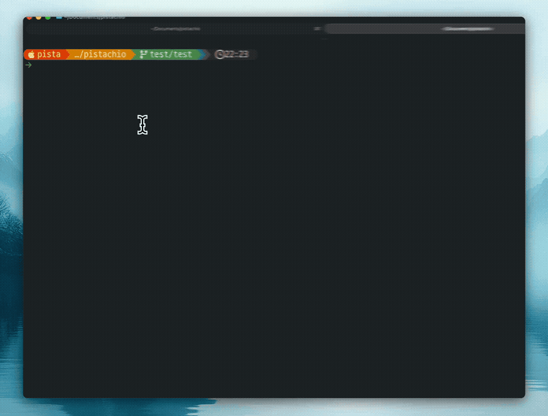
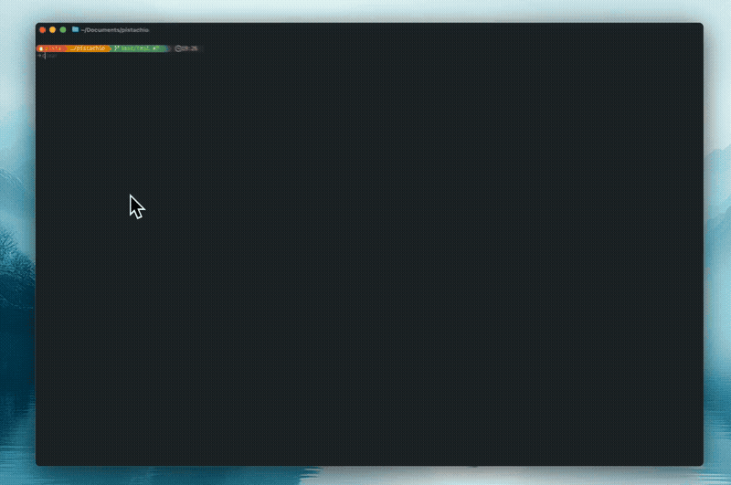
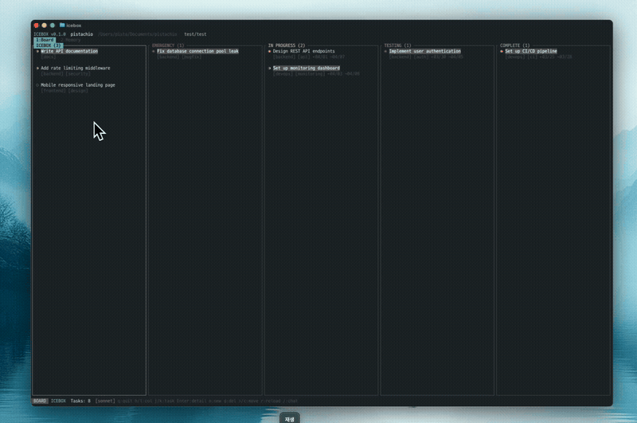
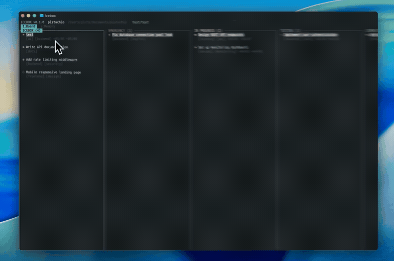
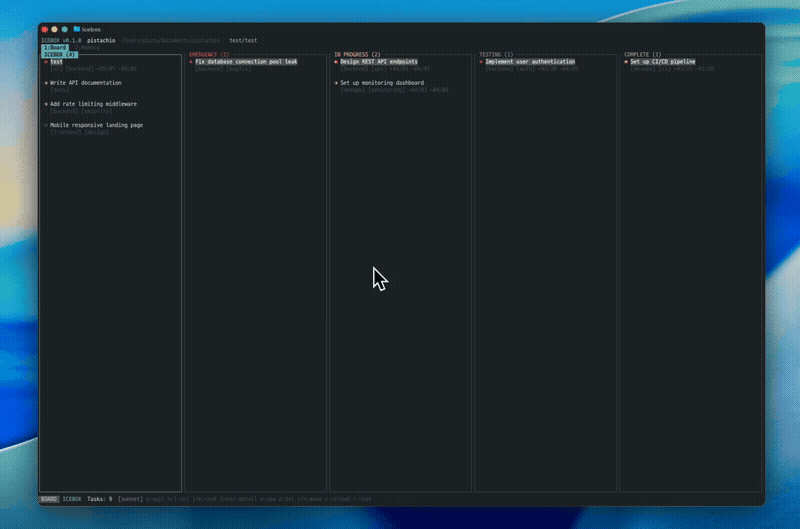

# Icebox

**Tablero Kanban TUI en Rust con Barra Lateral AI**

[English](README.md) | [한국어](README.ko.md) | [日本語](README.ja.md) | [中文](README.zh.md) | [Español](README.es.md)

Un tablero kanban basado en terminal construido con Rust, con un asistente AI integrado impulsado por la API de Anthropic. Gestiona tareas con atajos estilo Vim, chatea con AI por tarea y deja que la AI interactúe con tu tablero y sistema de archivos a través de herramientas integradas.

## Demo

### 01. Instalación y ejecución
> Instala con Homebrew y abre el tablero con un solo comando.



### 02. Kanban y detalle de tareas
> Gestiona tareas en 5 columnas y ve los detalles en la barra lateral.



### 03. Crear tarea
> Pulsa `n` para ingresar título, etiquetas y prioridad — se añade al tablero al instante.



### 04. Barra lateral AI
> Cada tarea tiene una sesión AI aislada para conversación y ejecución de herramientas.



### 05. Creación de tareas con AI
> Crea tareas a través del chat AI inferior y refléjalas en el tablero.



## Características

- **Kanban de 5 columnas** — Icebox, Emergency, In Progress, Testing, Complete
- **Barra lateral AI** — Conversaciones AI por tarea + respuestas en streaming
- **Sesiones por tarea** — Cada tarea mantiene su historial AI independiente, guardado en disco
- **Herramientas integradas** — AI puede ejecutar comandos, leer/escribir archivos, buscar código, crear/actualizar tareas
- **Comandos slash** — 18 comandos para gestión del tablero, control AI y autenticación
- **OAuth PKCE** — Login via claude.ai con flujo de navegador
- **Soporte de ratón** — Clic para seleccionar, arrastrar para desplazar, clic para enfocar
- **Selección de texto** — Arrastra para seleccionar y copiar respuestas AI
- **Swimlanes** — Filtrado por swimlane basado en pestañas, navegación con `[`/`]`
- **Enlaces estilo Notion** — Auto-detección de commit, PR, issue y branch
- **Fechas de tarea** — Fecha de inicio y fecha límite por tarea
- **Memoria AI** — Memoria de contexto persistente entre sesiones
- **Almacenamiento de tareas** — Archivos Markdown con YAML frontmatter (`.icebox/tasks/`)

## Instalación

### Instalación rápida

```bash
curl -fsSL https://raw.githubusercontent.com/SteelCrab/icebox/main/install.sh | bash
```

### Homebrew

```bash
brew tap SteelCrab/tap
brew install icebox
```

### Desde fuente (cargo install)

```bash
cargo install --git https://github.com/SteelCrab/icebox.git
```

### Compilar desde fuente

```bash
git clone https://github.com/SteelCrab/icebox.git
cd icebox
cargo build --release
cp target/release/icebox ~/.cargo/bin/
```

### Binarios precompilados (manual)

Para entornos donde `install.sh` no se puede usar, descarga el binario
para tu plataforma desde la [última versión](https://github.com/SteelCrab/icebox/releases/latest):

| Plataforma | Arquitectura | Archivo |
|---|---|---|
| macOS | Apple Silicon (arm64) | `icebox-aarch64-apple-darwin.tar.gz` |
| Linux | x86_64 (glibc) | `icebox-x86_64-unknown-linux-gnu.tar.gz` |
| Linux | x86_64 (musl / Alpine) | `icebox-x86_64-unknown-linux-musl.tar.gz` |
| Linux | aarch64 (glibc) | `icebox-aarch64-unknown-linux-gnu.tar.gz` |
| Linux | aarch64 (musl / Alpine) | `icebox-aarch64-unknown-linux-musl.tar.gz` |
| Linux | armv7 (Raspberry Pi 2/3) | `icebox-armv7-unknown-linux-gnueabihf.tar.gz` |

```bash
tar -xzf icebox-<target>.tar.gz
chmod +x icebox
mv icebox ~/.local/bin/    # o cualquier directorio en $PATH
```

## Inicio rápido

### Requisitos previos

- Toolchain de Rust (edition 2024)
- Clave API de Anthropic o cuenta de Claude.ai

### Inicializar workspace

```bash
icebox init              # Inicializar .icebox/ en el directorio actual
icebox init ./my-board   # Inicializar en una ruta específica
```

### Ejecutar en una ruta específica

```bash
icebox                   # Lanzar TUI en el directorio actual
icebox ./my-board        # Lanzar TUI en la ruta dada
```

### Autenticación

Configurar clave API (recomendado):

```bash
export ANTHROPIC_API_KEY=sk-ant-...
icebox
```

O login via OAuth:

```bash
icebox login           # Abre el navegador
icebox login --console # Flujo por consola
icebox whoami          # Verificar estado de autenticación
```

## Atajos de teclado

### Modo Board

| Tecla | Acción |
|-------|--------|
| `h/l`, `←/→` | Mover entre columnas |
| `j/k`, `↑/↓` | Mover entre tareas |
| `Enter` | Abrir detalle en barra lateral |
| `n` | Crear nueva tarea |
| `d` | Eliminar tarea (confirmar con y/Enter) |
| `>/<` | Mover tarea a columna siguiente/anterior |
| `[/]` | Cambiar pestaña swimlane |
| `/` | Alternar panel de chat AI inferior |
| `1/2` | Cambiar pestaña (Board / Memory) |
| `r` | Refrescar |
| `q`, `Ctrl+C` | Salir |
| Clic del ratón | Seleccionar tarea + abrir detalle |
| Clic del ratón (barra swimlane) | Cambiar swimlane |
| Scroll del ratón | Navegación |

### Modo Detail (Barra lateral)

| Tecla | Acción |
|-------|--------|
| `Tab`, `i` | Ciclo de foco: detalle → chat → entrada |
| `e` | Editar tarea (título/cuerpo) |
| `j/k` | Desplazar barra lateral |
| `>/<` | Mover tarea entre columnas |
| `Esc` | Desenfocar (jerárquico) / Volver al tablero |
| `q` | Volver al tablero |

### Modo Edit

| Tecla | Acción |
|-------|--------|
| `Tab` | Cambiar Título ↔ Cuerpo |
| `Ctrl+S` | Guardar |
| `Esc` | Cancelar |
| `Enter` | Siguiente campo / nueva línea |

### Chat AI inferior

| Tecla | Acción |
|-------|--------|
| `/` (Board) | Alternar panel |
| `Esc` | Desenfocar |
| `Enter` | Enviar mensaje |
| `Tab` | Autocompletar comando slash |
| `Ctrl+↑/↓` | Redimensionar panel |

## Comandos slash

| Categoría | Comando | Descripción |
|-----------|---------|-------------|
| **Board** | `/new <title>` | Crear tarea |
| | `/move <column>` | Mover tarea |
| | `/delete <id>` | Eliminar tarea |
| | `/search <query>` | Buscar tareas |
| | `/export` | Exportar tablero como Markdown |
| | `/diff` | Git diff |
| | `/swimlane [name \| clear]` | Configurar swimlane/listar |
| **AI** | `/help` | Lista de comandos |
| | `/status` | Estado de sesión |
| | `/cost` | Uso de tokens |
| | `/clear` | Limpiar conversación |
| | `/compact` | Comprimir conversación |
| | `/model [name]` | Cambiar modelo |
| | `/remember <text>` | Guardar memoria de contexto AI |
| | `/memory` | Vista de gestión de memoria |
| **Auth** | `/login` | Login OAuth |
| | `/logout` | Cerrar sesión |
| **Session** | `/resume [id]` | Reanudar sesión |

## Almacenamiento de tareas

Las tareas se almacenan como archivos Markdown en `.icebox/tasks/{id}.md`:

```markdown
---
id: "uuid"
title: "Título de la tarea"
column: inprogress    # icebox | emergency | inprogress | testing | complete
priority: high        # low | medium | high | critical
tags: ["backend", "auth"]
swimlane: "backend"
start_date: "2026-04-01T00:00:00Z"
due_date: "2026-04-10T00:00:00Z"
created_at: "ISO8601"
updated_at: "ISO8601"
---

Cuerpo en Markdown...

## Referencias
- commit:abc1234
- PR#42
- branch:feature/auth
```

Las sesiones AI se guardan automáticamente por tarea en `.icebox/sessions/{task_id}.json`.

### Estructura del workspace

```
.icebox/
├── .gitignore          # Auto-generado (ignora sessions/, memory.json)
├── tasks/              # Archivos Markdown de tareas
│   └── {id}.md
├── sessions/           # Sesiones de chat AI por tarea
│   ├── __global__.json
│   └── {task_id}.json
└── memory.json         # Entradas de memoria AI
```

## Arquitectura

```
crates/
  icebox-cli/   # Binario principal — Subcomandos CLI, runtime TUI
  tui/          # TUI — app, board, column, card, sidebar, input, layout, theme
  task/         # Dominio — Task, Column, Priority, frontmatter, TaskStore
  api/          # API — AnthropicClient, streaming SSE, AuthMethod, reintentos
  runtime/      # Runtime — ConversationRuntime, Session, OAuth PKCE, UsageTracker
  tools/        # 12 herramientas — bash, read/write_file, glob/grep_search, kanban (list/create/update/move), memoria
  commands/     # 18 comandos slash (Board, AI, Auth, Session)
```

## Herramientas AI integradas

| Herramienta | Descripción |
|-------------|-------------|
| `bash` | Ejecutar comandos shell |
| `read_file` | Leer contenido de archivos |
| `write_file` | Crear/escribir archivos |
| `glob_search` | Buscar archivos por patrón glob |
| `grep_search` | Buscar contenido con expresiones regulares |
| `list_tasks` | Listar tareas del kanban |
| `create_task` | Crear nueva tarea |
| `update_task` | Actualizar tarea existente (título, prioridad, etiquetas, swimlane, fechas, cuerpo) |
| `move_task` | Mover tarea entre columnas |
| `save_memory` | Guardar memoria de contexto AI |
| `list_memories` | Listar memorias guardadas |
| `delete_memory` | Eliminar entrada de memoria |

## Variables de entorno

| Variable | Descripción | Predeterminado |
|----------|-------------|----------------|
| `ANTHROPIC_API_KEY` | Clave API (recomendado) | — |
| `ANTHROPIC_AUTH_TOKEN` | Token Bearer | — |
| `ANTHROPIC_BASE_URL` | URL de la API | `https://api.anthropic.com` |
| `ANTHROPIC_MODEL` | Modelo | `claude-sonnet-4-20250514` |
| `ICEBOX_CONFIG_HOME` | Directorio de configuración | `~/.icebox` |

## Licencia

Distribuido bajo la [Apache License, Version 2.0](LICENSE).
