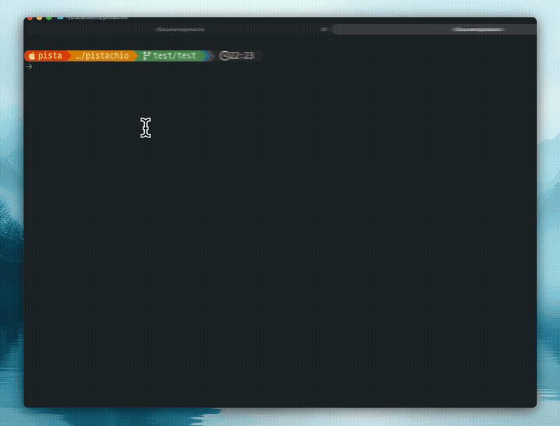
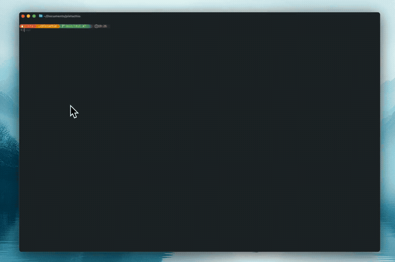
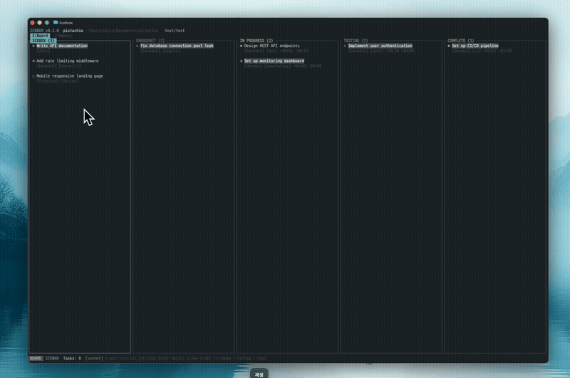
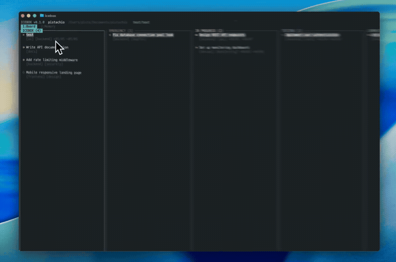
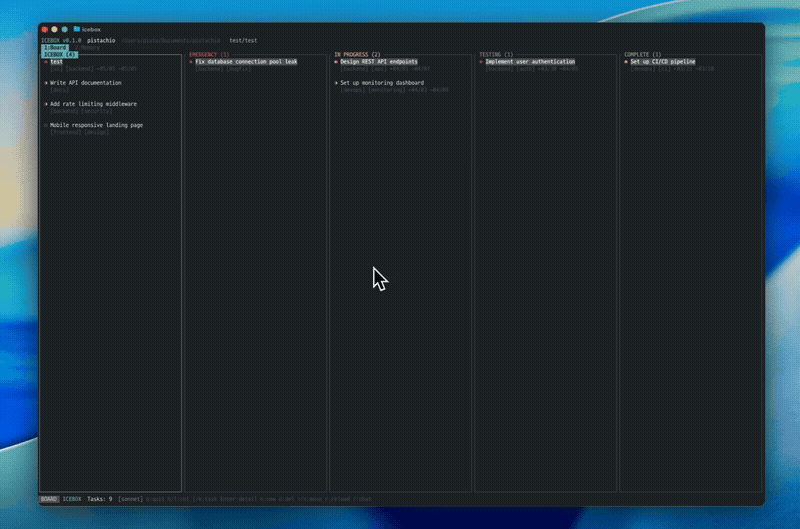

# Icebox

**Rust TUI Kanban Board with AI Sidebar**

[English](README.md) | [한국어](README.ko.md) | [日本語](README.ja.md) | [中文](README.zh.md) | [Español](README.es.md)

A terminal-based kanban board built with Rust, featuring an integrated AI assistant powered by the Anthropic API. Manage tasks with vim-style keybindings, chat with AI per task, and let the AI interact with your board and filesystem through built-in tools.

## Demo

### 01. Install & Launch
> Install with Homebrew and open the board with a single command.



### 02. Kanban & Task Detail
> Manage tasks across 5 columns and view details in the sidebar.



### 03. Create Task
> Press `n` to enter title, tags, and priority — added to the board instantly.



### 04. AI Sidebar
> Each task has an isolated AI session for conversation and tool execution.



### 05. AI Task Creation
> Create tasks through the bottom AI chat and reflect them on the board.



## Features

- **5-Column Kanban Board** — Icebox, Emergency, In Progress, Testing, Complete
- **AI Sidebar** — Per-task AI conversations with streaming responses
- **Per-Task Sessions** — Each task maintains its own AI chat history, persisted to disk
- **Built-in Tools** — 15 AI tools: shell, file I/O, code search, kanban ops, memory, Notion sync
- **Slash Commands** — 19 commands for board management, AI control, auth, and sessions
- **OAuth PKCE** — Login via claude.ai with automatic browser flow
- **Mouse Support** — Click to select tasks, drag to scroll, click to focus input
- **Text Selection** — Drag to select and copy AI responses
- **Notion-style Links** — Auto-parsed commit, PR, issue, and branch references
- **Task Dates** — Start date and due date tracking per task
- **Swimlanes** — Tab-based swimlane filtering with `[`/`]` navigation
- **AI Memory** — Persistent memory across sessions for AI context
- **Task Storage** — Markdown files with YAML frontmatter (`.icebox/tasks/`)
- **Web UI** — Responsive local kanban board in the browser via `icebox web`
- **MCP Server** — `icebox mcp` exposes 12 kanban tools to Claude Code over JSON-RPC stdio
- **Notion Sync** — `/notion push|pull|status` bidirectional database sync
- **Cross-Platform** — macOS (arm64), Linux (x86_64/aarch64/armv7, glibc/musl), Windows (x86_64/aarch64)
- **Self-Update** — `icebox upgrade` pulls the latest release binary

## Installation

### macOS

#### Quick Install

```bash
curl -fsSL https://raw.githubusercontent.com/SteelCrab/icebox/main/install.sh | bash
```

#### Homebrew

```bash
brew tap SteelCrab/tap
brew install icebox
```

#### Pre-built Binary (manual)

Download from the [latest release](https://github.com/SteelCrab/icebox/releases/latest):

| Architecture | Asset |
|---|---|
| Apple Silicon (arm64) | `icebox-aarch64-apple-darwin.tar.gz` |

```bash
tar -xzf icebox-aarch64-apple-darwin.tar.gz
chmod +x icebox
mv icebox ~/.local/bin/    # or any directory in $PATH
```

### Linux

#### Quick Install

```bash
curl -fsSL https://raw.githubusercontent.com/SteelCrab/icebox/main/install.sh | bash
```

#### Pre-built Binaries (manual)

Download from the [latest release](https://github.com/SteelCrab/icebox/releases/latest):

| Architecture | libc | Asset |
|---|---|---|
| x86_64 | glibc | `icebox-x86_64-unknown-linux-gnu.tar.gz` |
| x86_64 | musl (Alpine) | `icebox-x86_64-unknown-linux-musl.tar.gz` |
| aarch64 | glibc | `icebox-aarch64-unknown-linux-gnu.tar.gz` |
| aarch64 | musl (Alpine) | `icebox-aarch64-unknown-linux-musl.tar.gz` |
| armv7 (Raspberry Pi 2/3) | gnueabihf | `icebox-armv7-unknown-linux-gnueabihf.tar.gz` |

```bash
tar -xzf icebox-<target>.tar.gz
chmod +x icebox
mv icebox ~/.local/bin/    # or any directory in $PATH
```

### Windows

#### Quick Install (PowerShell)

```powershell
$ErrorActionPreference = 'Stop'
$arch = if ($env:PROCESSOR_ARCHITECTURE -eq 'ARM64') { 'aarch64' } else { 'x86_64' }
$asset = "icebox-$arch-pc-windows-msvc.zip"
$dest = "$env:USERPROFILE\icebox"
Invoke-WebRequest "https://github.com/SteelCrab/icebox/releases/latest/download/$asset" -OutFile "$env:TEMP\$asset"
Expand-Archive "$env:TEMP\$asset" -DestinationPath $dest -Force
[Environment]::SetEnvironmentVariable('Path', "$dest;" + [Environment]::GetEnvironmentVariable('Path','User'), 'User')
```

Restart the shell, then run `icebox`.

#### Pre-built Binaries (manual)

Download from the [latest release](https://github.com/SteelCrab/icebox/releases/latest):

| Architecture | Asset |
|---|---|
| x86_64 | `icebox-x86_64-pc-windows-msvc.zip` |
| aarch64 (ARM64) | `icebox-aarch64-pc-windows-msvc.zip` |

```powershell
Expand-Archive icebox-x86_64-pc-windows-msvc.zip -DestinationPath $env:USERPROFILE\icebox
# Add %USERPROFILE%\icebox to PATH (System Properties → Environment Variables)
```

### From Source (any OS)

#### Cargo Install

```bash
cargo install --git https://github.com/SteelCrab/icebox.git
```

#### Build from Source

```bash
git clone https://github.com/SteelCrab/icebox.git
cd icebox
cargo build --release
cp target/release/icebox ~/.cargo/bin/
```

## Quick Start

### Prerequisites

- Rust toolchain (edition 2024)
- Anthropic API key or Claude.ai account

### Initialize Workspace

```bash
icebox init              # Initialize .icebox/ in current directory
icebox init ./my-board   # Initialize at a specific path
```

### Run at a Specific Path

```bash
icebox                   # Launch TUI in current directory
icebox ./my-board        # Launch TUI at the given path
```

### Launch Web UI

```bash
icebox web                            # http://localhost:3000 (cwd)
icebox web --path ./my-board          # specify workspace
icebox web --port 8080                # specify port
```

See the **[Web UI Guide](docs/web.md)** for details.

### All-in-One Setup

```bash
icebox init --all        # ★ Recommended — creates .icebox/, .mcp.json, Claude Code memory
```

Prompts Y/n for each step and prints the exact memory content before writing.

### Self-Update

```bash
icebox upgrade           # Download and install the latest release binary
```

### Authentication

Set your API key (recommended):

```bash
export ANTHROPIC_API_KEY=sk-ant-...
icebox
```

Or login via OAuth:

```bash
icebox login           # Opens browser
icebox login --console # Console-based flow
icebox whoami          # Check auth status
```

## Keybindings

### Board Mode

| Key | Action |
|-----|--------|
| `h/l`, `Left/Right` | Move between columns |
| `j/k`, `Up/Down` | Move between tasks |
| `Enter` | Open task detail sidebar |
| `n` | Create new task |
| `d` | Delete task (confirm with y/Enter) |
| `>/<` | Move task to next/previous column |
| `[/]` | Switch swimlane tab |
| `/` | Toggle bottom AI chat panel |
| `1/2` | Switch tab (Board / Memory) |
| `r` | Refresh board |
| `q`, `Ctrl+C` | Quit |
| Mouse click | Select task + open detail |
| Mouse click (swimlane bar) | Switch swimlane |
| Mouse scroll | Navigate |

### Detail Mode (Sidebar)

| Key | Action |
|-----|--------|
| `Tab`, `i` | Cycle focus: detail → chat → input |
| `e` | Edit task (title/body) |
| `j/k` | Scroll sidebar |
| `>/<` | Move task between columns |
| `Esc` | Unfocus (layered) / Return to board |
| `q` | Return to board |

### Edit Mode

| Key | Action |
|-----|--------|
| `Tab` | Switch Title / Body |
| `Ctrl+S` | Save |
| `Esc` | Cancel |
| `Enter` | Next field / newline |

### Bottom AI Chat

| Key | Action |
|-----|--------|
| `/` (Board) | Toggle panel |
| `Esc` | Unfocus |
| `Enter` | Send message |
| `Tab` | Autocomplete slash command |
| `Ctrl+Up/Down` | Resize panel |

## Slash Commands

| Category | Command | Description |
|----------|---------|-------------|
| **Board** | `/new <title>` | Create task |
| | `/move <column>` | Move task |
| | `/delete <id>` | Delete task |
| | `/search <query>` | Search tasks |
| | `/export` | Export board as markdown |
| | `/diff` | Show git diff |
| | `/notion [push \| pull \| status \| reset]` | Notion DB sync |
| | `/swimlane [name \| clear]` | Set swimlane on task or list swimlanes |
| **AI** | `/help` | Command list |
| | `/status` | Session status |
| | `/cost` | Token usage |
| | `/clear` | Clear conversation |
| | `/compact` | Compress conversation |
| | `/model [name]` | Switch model |
| | `/remember <text>` (alias `/rem`) | Save memory for AI context |
| | `/memory` (alias `/mem`) | Memory management view |
| **Auth** | `/login` | OAuth login |
| | `/logout` | Logout |
| **Session** | `/resume [id]` | Resume session |

## Task Storage

Tasks are stored as markdown files in `.icebox/tasks/{id}.md`:

```markdown
---
id: "uuid"
title: "Task title"
column: inprogress    # icebox | emergency | inprogress | testing | complete
priority: high        # low | medium | high | critical
tags: ["backend", "auth"]
swimlane: "backend"
start_date: "2026-04-01T00:00:00Z"
due_date: "2026-04-10T00:00:00Z"
created_at: "ISO8601"
updated_at: "ISO8601"
---

Task body in markdown...

## References
- commit:abc1234
- PR#42
- branch:feature/auth
```

AI sessions are persisted per task in `.icebox/sessions/{task_id}.json`.

### Workspace Structure

```
.icebox/
├── .gitignore          # Auto-generated (ignores sessions/, memory.json)
├── tasks/              # Task markdown files
│   └── {id}.md
├── sessions/           # Per-task AI chat sessions
│   ├── __global__.json
│   └── {task_id}.json
└── memory.json         # AI memory entries
```

## Web UI

`icebox web` launches a lightweight local web server in-process (single binary — no separate `icebox-web` executable required). It reads the same `.icebox/tasks/` files as the TUI — no separate data store.

```bash
icebox web                            # http://localhost:3000 (cwd)
icebox web --path ./my-board --port 8080
```

See the **[Web UI Guide](docs/web.md)** for options, responsive layout details, and architecture.

## Architecture

```
crates/
  icebox-cli/   # Main binary — CLI subcommands, TUI runtime, MCP server
  tui/          # TUI — app, board, column, card, sidebar, input, layout, theme
  task/         # Domain — Task, Column, Priority, frontmatter, TaskStore
  api/          # API — AnthropicClient, SSE streaming, AuthMethod, retry
  runtime/      # Runtime — ConversationRuntime, Session, OAuth PKCE, UsageTracker
  tools/        # 15 tools — bash, file I/O, search, kanban, memory, Notion sync
  commands/     # 19 slash commands (Board, AI, Auth, Session)
  icebox-web/   # Web UI library — Axum HTTP server (linked into icebox binary via `icebox web`)
```

## Built-in AI Tools

| Tool | Description |
|------|-------------|
| `bash` | Execute shell commands (`sh -c` on Unix, `cmd /C` on Windows) |
| `read_file` | Read file contents |
| `write_file` | Write/create files (auto-mkdir on missing parents) |
| `glob_search` | Find files by glob pattern |
| `grep_search` | Search file contents with regex |
| `list_tasks` | List all kanban tasks by column |
| `list_swimlanes` | List all swimlanes in the workspace |
| `filter_tasks` | Filter tasks by column, priority, swimlane, tag, or date |
| `create_task` | Create a new task |
| `update_task` | Update existing task (title, priority, tags, swimlane, dates, body) |
| `move_task` | Move task to another column |
| `notion_sync` | Push or pull tasks to/from a Notion database |
| `save_memory` | Save persistent memory for AI context (global or per-task) |
| `list_memories` | List saved memories |
| `delete_memory` | Delete a memory entry |

## MCP Server

`icebox mcp` runs a JSON-RPC 2.0 MCP server over stdio, exposing 12 kanban tools to Claude Code and other MCP clients.

Project-local config (`.mcp.json`):

```json
{
  "mcpServers": {
    "icebox": {
      "command": "icebox",
      "args": ["mcp"]
    }
  }
}
```

Global config (`~/.claude/settings.json`):

```json
{
  "mcpServers": {
    "icebox": {
      "command": "icebox",
      "args": ["mcp", "--workspace", "/path/to/project"]
    }
  }
}
```

See the **[MCP Guide](docs/mcp.md)** for the full tool list and protocol details.

## Notion Sync

Bidirectional sync between `.icebox/tasks/` and a Notion database.

```bash
export NOTION_API_KEY=secret_...
icebox notion            # Setup guide
```

Inside the TUI:

```
/notion push             # Local → Notion
/notion pull             # Notion → local (safe — won't delete local tasks)
/notion status           # Show sync state
/notion reset            # Forget the configured database
```

See the **[Notion Guide](docs/notion.md)** for setup and field mapping.

## Environment Variables

| Variable | Description | Default |
|----------|-------------|---------|
| `ANTHROPIC_API_KEY` | API key (recommended, highest priority) | — |
| `ANTHROPIC_AUTH_TOKEN` | Bearer token | — |
| `ANTHROPIC_BASE_URL` | API URL | `https://api.anthropic.com` |
| `ANTHROPIC_MODEL` | Model (OAuth default: `claude-haiku-4-5-20251001`) | auth-aware |
| `NOTION_API_KEY` | Notion integration token (for `/notion` sync) | — |
| `ICEBOX_CONFIG_HOME` | Config directory | `~/.icebox` |

## License

Licensed under the [Apache License, Version 2.0](LICENSE).
